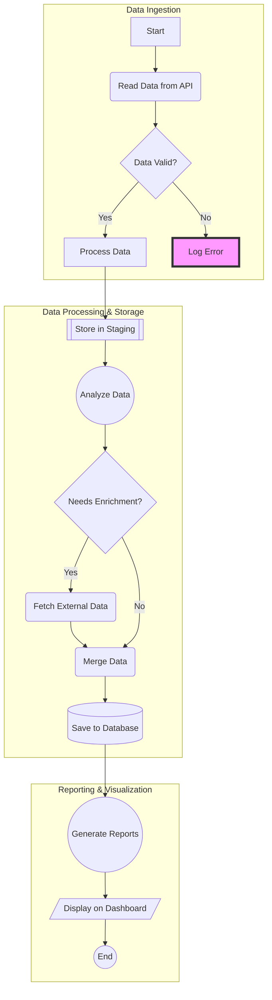
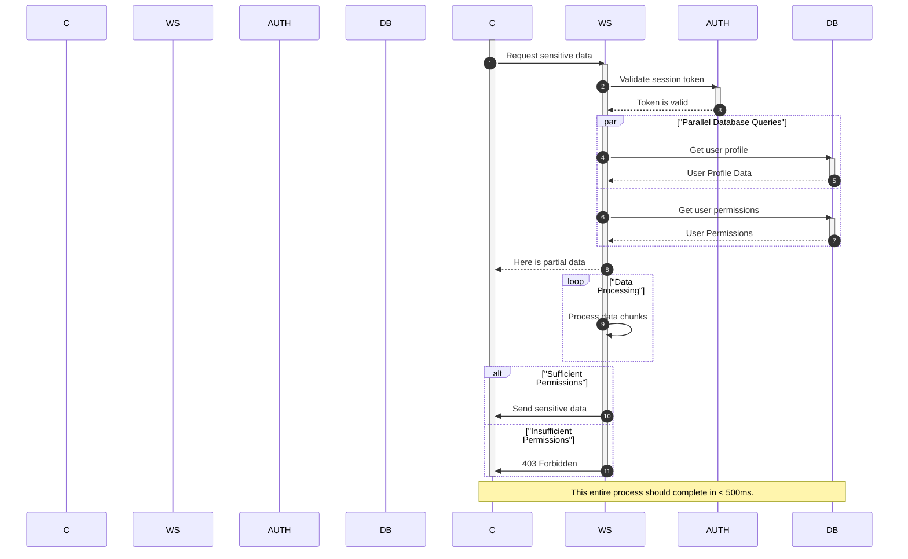
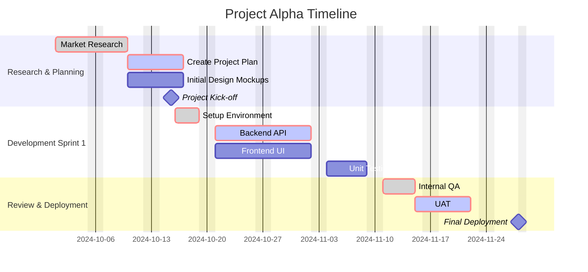
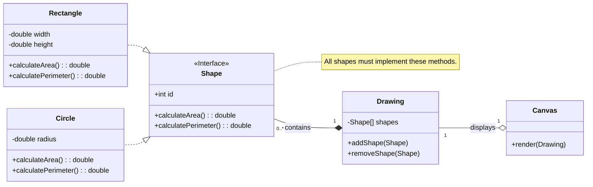
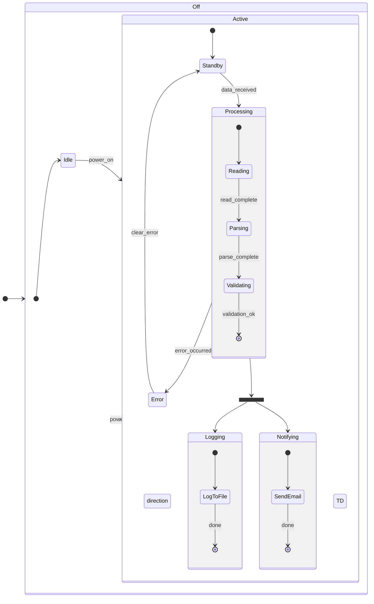
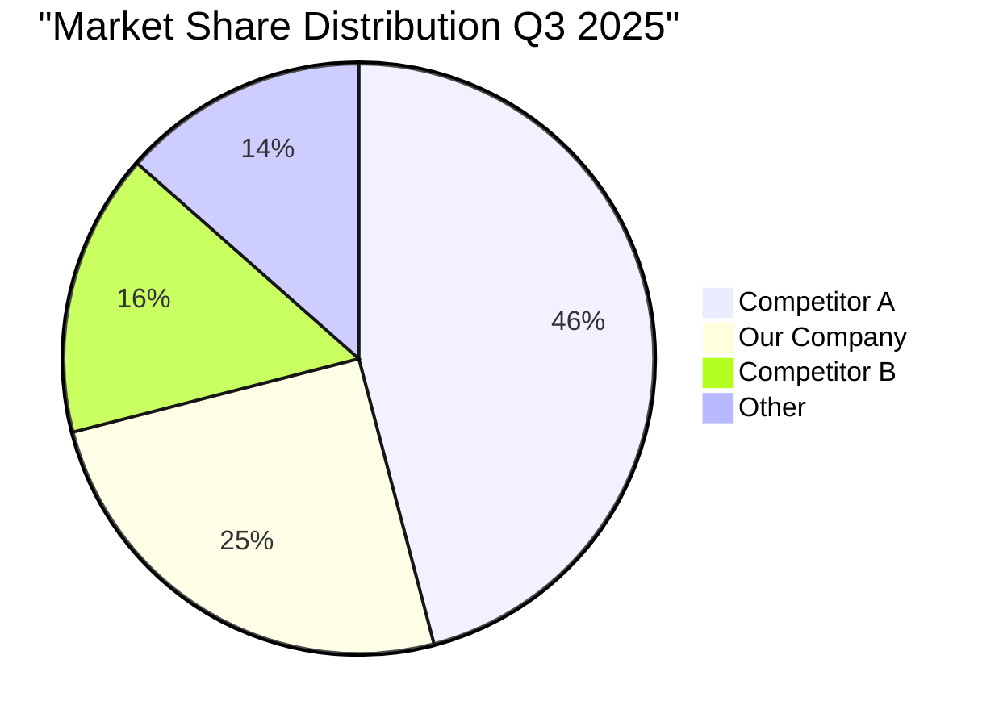
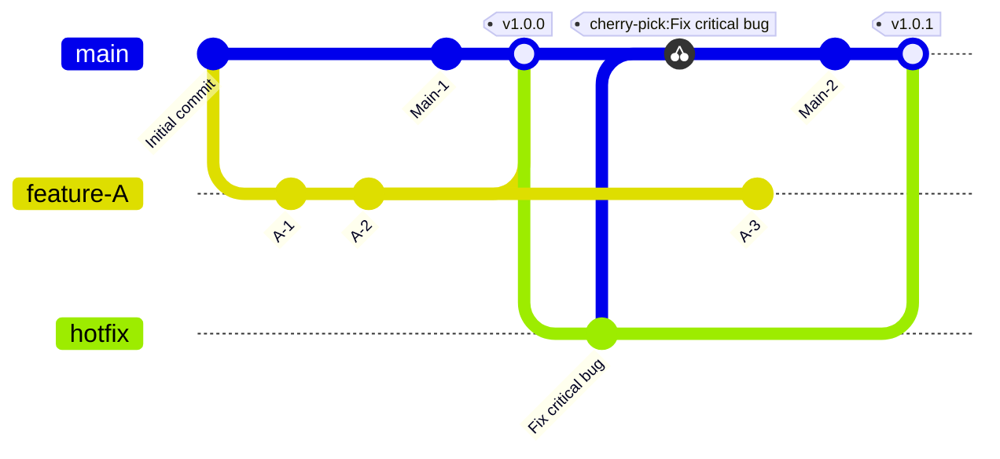
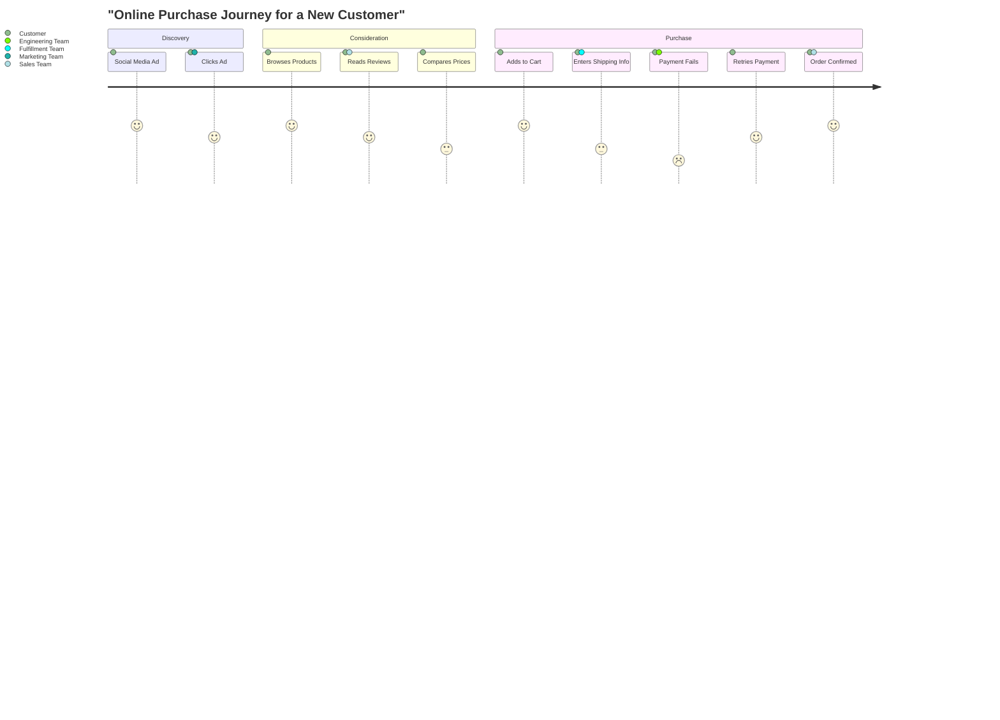
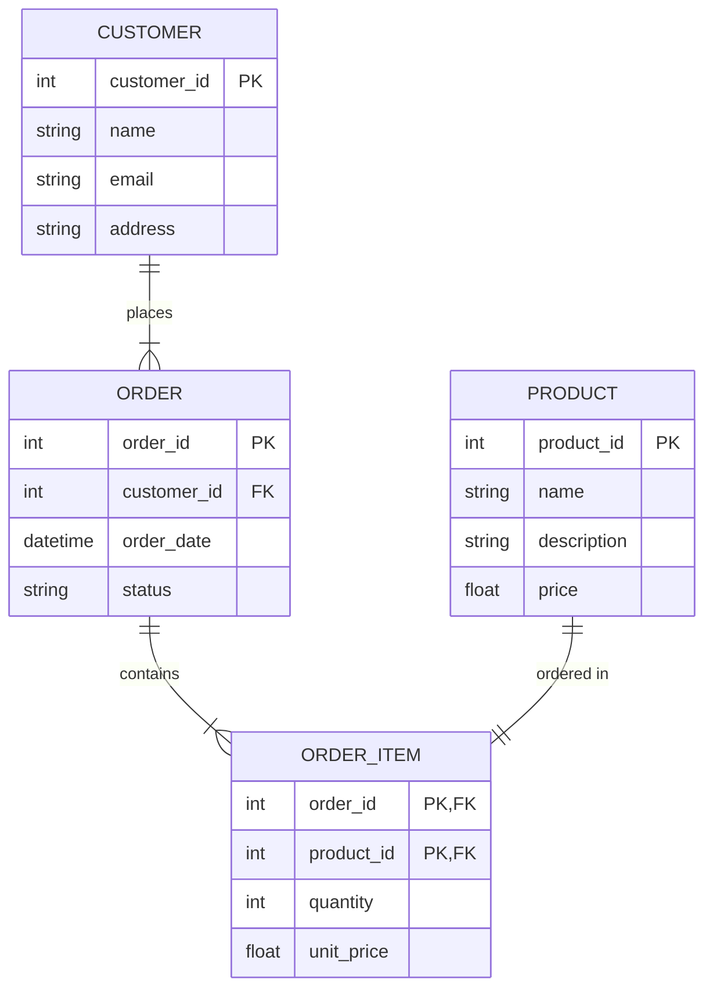

# Mermaid Diagram Guide

A reference for crafting complex Mermaid diagrams with ready-to-paste examples and failure modes for LLMs and humans.

This document serves as a comprehensive reference guide and a collection of advanced examples for generating diagrams using Mermaid syntax. It is designed to be a foundational resource for Large Language Models (LLMs) to learn the patterns, complexities, and nuances of each diagram type. It also includes a critical section on common syntax errors and how to avoid them.

### Part 1: Critical Syntax Rules and Error Avoidance

Before exploring the examples, it is crucial to understand the most common source of errors when writing Mermaid code: syntax violations. A Mermaid parser is strict and expects only valid diagram syntax within its designated code block.

#### How to Avoid Syntax Errors

**1. Isolate the Code Block: The "Sacred Space" Rule**
All explanations, titles, and commentary must live outside the fenced ```mermaid ...``` block. These fences define the boundaries of the code that will be parsed.

**2. Use Mermaid's Official Comment Syntax (`%%`)**
If you need to leave notes *inside* the code for clarity or debugging, use the `%%` syntax. The parser will ignore any text on a line following a double percentage sign. This is the only safe way to add comments inside the code block.

- **Correct Usage of Comments:**
    ```mermaid
    sequenceDiagram
        %% This is a valid comment and will be ignored.
        autonumber
        Client->>Server: Request data
    ```

**3. Case Study: The Unterminated Code Block Error**
A frequent and critical error is forgetting the closing triple-backtick fence. If the block is not closed, the parser will continue to read the rest of the document, trying to interpret Markdown headings or even other code blocks as part of the initial diagram. This leads to confusing error messages about "unexpected characters" or "expecting X, got Y," as the parser finds text that doesn't match the diagram's grammar. **Always ensure every ```mermaid``` opener has a matching closing triple-backtick.**

**4. Build and Validate Incrementally**
When creating a complex diagram, write and validate it in small parts. Use a live tool, such as the **[Mermaid Live Editor](https://mermaid.live)**, to paste your code as you write it. This allows you to catch errors immediately.

---

### Part 2: Advanced Diagram Examples

This section contains a library of corrected and validated examples for various Mermaid diagram types.

#### 1. Flowchart
Represents workflows with subgraphs, varied node shapes, styling, and interactive links.



#### 2. Sequence Diagram
Illustrates object interactions over time with aliases, activation, parallel actions, loops, and conditional alternatives.



#### 3. Gantt Chart
Used for project scheduling, showcasing sections, milestones, critical paths, and date exclusions.



#### 4. Class Diagram
Models the static structure of a system, featuring interfaces, inheritance, composition, aggregation, and cardinality.



#### 5. State Diagram
Describes the behavior of state machines, including nested states, forks for parallel states, and joins.



#### 6. Pie Chart
Shows proportions of a whole, including a title for context.



#### 7. Git Graph
Visualizes complex repository histories, including branches, merges, tags, and cherry-picks.



#### 8. User Journey Diagram
Maps user experiences across stages, involving multiple stakeholders and emotional ratings.



#### 9. Entity Relationship Diagram (ERD)
Models database schemas with entities, attributes (PK, FK), cardinality, and a linking table for a many-to-many relationship.


